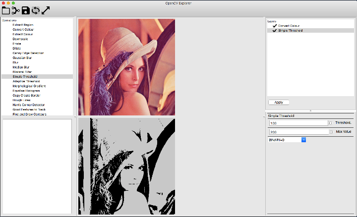

# opencv-explorer
A wxPython application that helps use OpenCV image processing routines in a 'pipeline' type of fashion. Makes working through sequences of image processing more interactive to help find which routines and parameters get you a usable result.

## Disclaimer
I am sharing this project in case it is useful to anyone out there. I am not planning to actively develop it a lot further, it was intended to get some basic stuff proven out quickly. It may or may not work for your needs and feel free to test it out. There is no warrantly associated with this piece of work. If it proves useful I would be keen to know but otherwise continue as you see fit.
It is currently in quite basic form although worked for my purposes. I will add things like settings and saving configuration. It is not meant to be a distributable quality application (yet!?).

If you find bugs or irritating features log them as issues although I make no promises about getting to them anytime soon.

## Background
Working on a project that had to explore different OpenCV techniques to try and extract 'intersting' information from an image. I found that layering different routines and trying different parameterisation of each routine took a lot of time. So much I often forgot what though path I was on at the time. This project was something I built to try and speed up the initial experimentation phase. Oh yes, I also wanted it to be easily configurable.

## Installation
Clone the repository and install dependedencies. Run the file opencv-exp.py and it should all work.
It is written in pure Python using the wxPython widgets library and OpenCV. It is easy to modify. I used wxFormBuilder to 'paint' the UI, never been partial to code layouts for quick and dirty projects.

## Usage
The interface consiste of three broad regions plus the toolbar.

[]

#### Toolbar
The toolbar has the following entries

* File open - open an image to work on
* Pipeline open - open an existing pre-defined sequence of steps and parameters (or layers as I refer to them as)
* Pipeline save - save current layers and parameter settings to a file
* Interactive update (Toggle) - apply layer updates as they are applied. The layer up to the one selected is applied.
* Stretch (Toggle) - images are resized to fit and the proportions are maintained by default. To stretch the image to available space toggle this button on

#### Left
This contains the list of avaliable operations that can be performed. These are added to the 'layers' list on the right. The bottom part of the left had side shows messages back from OpenCV operations. Useful if something fails. The messages can be a little cryptic but with practise you get familiar with them

#### Centre
There are two image areas. The top one is the source image, the bottom is the result of the layers that have been processed. Depending on the interactive and stretch toolbar buttons state the update may be automatic or an explicity 'apply' may be needed. 

#### Right
The top shows the layers selected and the sequence of their operation. The bottom will show the paramters for a selected layer. Layers are added by right clicking in the operations window (top-left) and adding to the list. Can be added at the end, before or after currently selected item in the layer list.

## Modification of the application
It is designed to make it easy to add OpenCV routines. The file OpenCVOperations.py contains a dictionary of entries that populate the available operations that can be performed. Adding new entries to this file is relatively straightforward.

This dictionary of entries controls what the paramater properties window displays. It also supports creating custom processes that may be a combination of steps that work for you.

Each operation is defined by a function and a set of parameter entries. These control default values and how the paramter editor is presented to the user. It supports things like Integers, Floats and Colour selection using wxWidgets.Currently the only reference on how to configure these is the file itself. There are numerous examples in the file that should demonstrate how to add your own operations and parameters. The only confusing parameter option is called 'control' that determines if a parameter needs a control to select a value. The parameter 'image' i salways needed and does not need a control, it is never configured but is passed into and out of each operation. The order in this file is the order in which the available operations are added to the top-left list in the UI.

